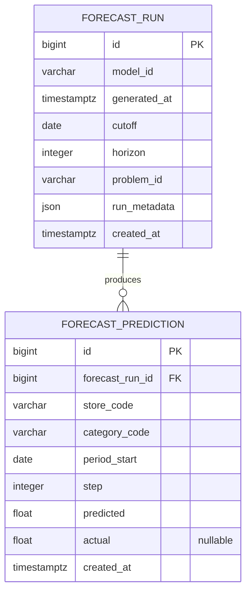

# Forecast evaluation

- **Scope:** Weekly category-demand frame, temporal splits, baselines, metrics, walk-forward backtest
- **Decisions:** [ADR-004](../adr/ADR-004-forecast-evaluation.md)

The first demand problem is weekly category demand per store. The code that
builds the frame, splits it, scores it and stores runs lives in
`apps/api/src/retailops_api/forecasting/`.

```bash
make forecast
```

That generates the development synthetic history in memory, builds the weekly
frame, walks the three baselines forward, and writes `data/forecasts/`:

| File | Contents |
|---|---|
| `forecast_frame.csv` | `store_code, category_code, period_start, target` |
| `benchmark.json` | Problem, holdout cutoffs, per-fold metrics and predictions |
| `benchmark.md` | Human-readable summary with the same metric definitions |

Pass `--persist` to write each fold as a `ForecastRun`. Use `--input` to score
an existing portable dataset instead of generating one.

## Problem

| Field | Value |
|---|---|
| Id | `weekly_category_store_demand` |
| Target | `units_sold` |
| Grain | `(store_code, category_code, period_start)` |
| Frequency | ISO week starting Monday |
| Horizon | 4 weeks |
| History window | Every complete ISO week in the source history |
| Aggregation | Sum of daily units across products in the category |
| Missing periods | Zero-fill; the panel is balanced |

A week is complete when Monday through Sunday all fall inside the history's
date span. Incomplete edge weeks are dropped. `category_code` is the product's
assigned category; parent categories are not rolled up.

## Temporal split

Time-series rows are never drawn at random. `split_temporal` cuts at two
inclusive week dates:

- **Train:** `period_start <= train_end`
- **Validation:** `train_end < period_start <= validation_end`
- **Test:** `period_start > validation_end`

The default holdout locks the last eight weeks as test and the four weeks
before that as validation. Those cutoffs are written on the benchmark so a
later model can use the same locked weeks. The numbers in the report come
from the rolling backtest, not from a single shot on the holdout.

## Baselines

All three implement `predict(history, cutoff, horizon)`. Rows after `cutoff`
must not be read.

| `model_id` | Rule | Fallback |
|---|---|---|
| `naive` | Repeat the last week on or before the cutoff | `0` if the entity has no history |
| `seasonal_naive` | Value at `origin + h − lag` (default lag 52) | Last week, then `0` |
| `moving_average` | Mean of the last `window` weeks (default 4), repeated across the horizon | Mean of the weeks that exist; `0` if none |

On a one-year development history the 52-week seasonal lookback is almost
never present, so seasonal naive matches naive until a second year exists.
`--seasonal-lag 4` is the same model with a monthly lag.

## Metrics

### MAE

Mean of `|predicted − actual|`.

### RMSE

Square root of the mean squared error.

### WAPE

`sum(|predicted − actual|) / sum(|actual|)`. When every actual is zero the
denominator is zero: WAPE is then `0` if every prediction is also zero, and
`1` if any prediction is non-zero.

### Forecast bias

`mean(predicted − actual)`. Positive values mean the model over-forecasts.
Defined when every actual is zero (it equals the mean prediction).

## Walk-forward backtest

At each origin the model may read history through that cutoff and forecasts
the next four weeks. Origins advance by one week. The first origin is the
week that first leaves twelve weeks of history; the last origin still has
four observed weeks after it.

Each fold records:

- cutoff
- horizon
- model
- metrics
- predictions (with actuals attached when the week exists)

Overall metrics are the micro-average of every scored pair across folds.

## Persistence



Both tables are immutable facts: `created_at` only, no `active`. Predictions
are identified by business codes so a run can be stored from a portable
dataset. Deleting a run removes its predictions (`ON DELETE CASCADE`).
Unique on `(forecast_run_id, store_code, category_code, period_start)`.
