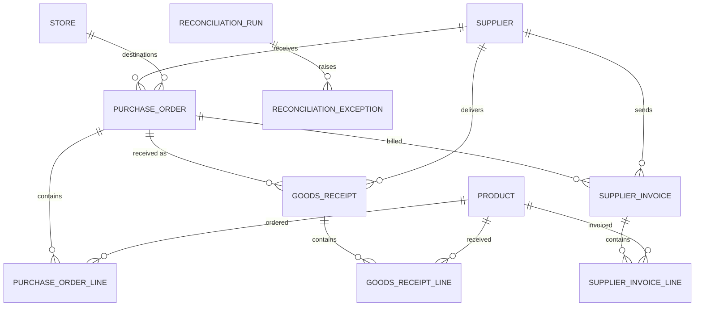

# Procurement and reconciliation

- **Scope:** Purchase orders, goods receipts, supplier invoices, three-way match
- **Migration:** `e8b1c03d4a29_procurement_reconciliation`
- **Decisions:** [ADR-007](../adr/ADR-007-procurement-reconciliation.md)

```bash
make reconcile supplier=SUP-BEVCO invoice=INV-1001
make reconcile supplier=SUP-BEVCO po=PO-1001
```

```bash
uv run retailops-reconcile --supplier SUP-BEVCO --invoice INV-1001
```

The command loads the invoice (or the purchase order), the other documents
that belong to that order, matches lines, compares quantities and prices,
applies the configured tolerances and persists a run plus its exceptions.
Optional explanations of those exceptions use the reviewer contract; see
[AI review](ai-review.md). Amounts stay on the run.

## Documents

| Entity | Identity | Notes |
|---|---|---|
| Purchase order | `(supplier, po_number)` | One store, one currency, status `open` / `partial` / `received` / `closed` / `cancelled` |
| Purchase order line | `(order, line_number)` | Positive ordered qty; unit cost, tax rate (%), tax amount, line total |
| Goods receipt | `(supplier, receipt_number)` | Optional PO; several receipts may share one order |
| Goods receipt line | `(receipt, line_number)` | Positive received qty; no money |
| Supplier invoice | `(supplier, invoice_number)` | Optional PO; duplicate number for the same supplier is rejected |
| Supplier invoice line | `(invoice, line_number)` | Product id may be empty; supplier SKU and EAN are matching hints |

Money is `NUMERIC(12, 4)` / `Decimal`. Quantities are integers. Dates are
calendar days. Cancelled headers are ignored.

## Matching

```text
supplier + PO number
        → product id
        → supplier SKU on that supplier's terms
        → EAN on the catalog
```

Ambiguous or empty results become exceptions. Nothing is inferred.

## What is compared

| Kind | Codes |
|---|---|
| Quantity | `short_receipt`, `over_receipt`, `over_invoice`, `under_invoice`, `invoice_without_receipt` |
| Price | `cost_mismatch`, `line_total_mismatch`, `unexpected_tax`, `currency_mismatch` |
| Identity | `unmatched_purchase_order`, `unmatched_line`, `ambiguous_line` |

`line_total` is checked against `quantity × unit_cost + tax`. Impact is
signed: extra cost is positive, a short receipt is negative.

## Tolerances

Defaults are explicit zeros. Raise them on the CLI:

```bash
uv run retailops-reconcile --supplier SUP-BEVCO --invoice INV-1001 \
    --quantity-tolerance 1 \
    --monetary-tolerance 0.0100 \
    --price-percent-tolerance 1.0000
```

A cost difference passes if it is within the monetary tolerance *or* the
percent of PO unit cost. Currency mismatches never pass.

## Runs

```text
select records → match → calculate → apply tolerances → persist exceptions → summarize
```

`scope_key` is `po:<supplier>:<po_number>` once the order is known, otherwise
`invoice:<supplier>:<invoice_number>`. The input fingerprint covers the
selected rows and the tolerances. The same fingerprint returns the same run;
a change stores the next version.

## Schema



Lines are removed with their header. A run's exceptions are removed with the
run. Catalog rows referenced by these documents cannot be deleted.

## Where the code lives

| Concern | Path |
|---|---|
| Models | `apps/api/src/retailops_api/domain/models/purchase_order.py`, `goods_receipt.py`, `supplier_invoice.py`, `reconciliation.py` |
| Money | `apps/api/src/retailops_api/procurement/money.py` |
| Matching | `apps/api/src/retailops_api/procurement/match.py` |
| Quantity and price rules | `apps/api/src/retailops_api/procurement/rules.py` |
| Orchestrator | `apps/api/src/retailops_api/procurement/orchestrate.py` |
| CLI | `apps/api/src/retailops_api/procurement/cli.py` |
