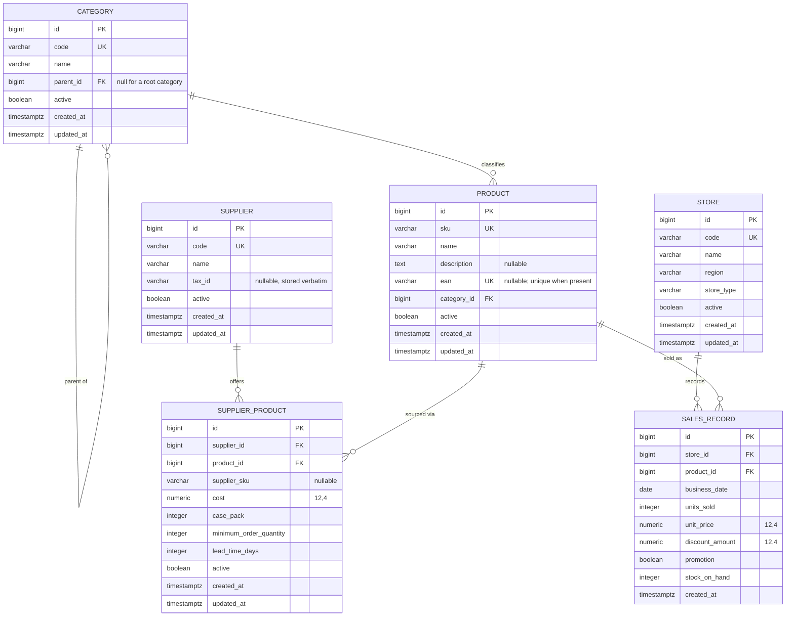

# Retail Domain ER Model

- **Scope:** Core retail domain and persistence
- **Migration:** `024162a4b5f3_core_retail_domain`
- **Decisions:** [ADR-002](../adr/ADR-002-core-retail-domain-model.md)

The catalog and historical-sales model that forecasting, supplier review and
procurement all read from. Every table lives in the default PostgreSQL schema
and is created by a single Alembic revision on top of the bootstrap revision.

## Entity relationships

## Reading the diagram

- **`CATEGORY` is a tree.** The self-relation is an adjacency list; a null `parent_id` is a root. Products hang off leaf categories in the seed data, though nothing in the schema requires that.
- **`SUPPLIER_PRODUCT` is an association entity, not a join table.** The commercial terms belong to the pairing, which is why one product can be offered by several suppliers at different cost and lead time.
- **`SALES_RECORD` is a daily fact.** One row per store, product and trading day. It is the only table without `updated_at` or `active`, because a sales fact is immutable once ingested.

## Keys and constraints

| Table | Unique | Check |
|---|---|---|
| `categories` | `code` | `parent_id IS NULL OR parent_id <> id` |
| `products` | `sku`; `ean` when present | — |
| `suppliers` | `code` | — |
| `supplier_products` | `(supplier_id, product_id)` | `cost >= 0`, `case_pack > 0`, `minimum_order_quantity >= 0`, `lead_time_days >= 0` |
| `stores` | `code` | — |
| `sales_records` | `(store_id, product_id, business_date)` | `units_sold >= 0`, `unit_price >= 0`, `discount_amount >= 0`, `stock_on_hand >= 0` |

Constraint and index names come from one metadata naming convention, so they are
predictable rather than server-generated:

| Kind | Pattern | Example |
|---|---|---|
| Primary key | `pk_<table>` | `pk_sales_records` |
| Foreign key | `fk_<table>_<columns>_<referred table>` | `fk_products_category_id_categories` |
| Unique | `uq_<table>_<columns>` | `uq_products_sku` |
| Check | `ck_<table>_<name>` | `ck_supplier_products_case_pack_positive` |
| Index | `ix_<table>_<columns>` | `ix_sales_records_business_date` |

## Indexes

Beyond the primary keys and the unique constraints:

| Table | Indexed columns |
|---|---|
| `categories` | `parent_id` |
| `products` | `category_id` |
| `stores` | `region`, `store_type` |
| `supplier_products` | `supplier_id`, `product_id` |
| `sales_records` | `store_id`, `product_id`, `business_date` |

Every foreign key is indexed because every read path filters on it, and each is
`ON DELETE RESTRICT`: catalog rows referenced by history cannot be deleted, so
retirement means setting `active = false`.

## Types

| Concern | Type | Why |
|---|---|---|
| Surrogate keys | `BIGINT` (identity) | Business codes change; keys must not. |
| Money and cost | `NUMERIC(12, 4)` → `Decimal` | Exact arithmetic; per-unit cost inside a case is not whole cents. |
| Quantities | `INTEGER` | Units, case packs and lead times cannot be fractional. |
| Trading day | `DATE` | A calendar concept, so no timezone can move a sale between days. |
| Timestamps | `TIMESTAMPTZ` | Multi-region ingestion must not mix wall-clock times. |

## Where the code lives

| Concern | Path |
|---|---|
| Base, naming convention, mixins | `apps/api/src/retailops_api/db/base.py` |
| Models | `apps/api/src/retailops_api/domain/models/` |
| Lookups and bulk sales writes | `apps/api/src/retailops_api/domain/repositories.py` |
| Development seed data | `apps/api/src/retailops_api/db/seed.py` |
| Portable dataset, validation, snapshot | `apps/api/src/retailops_api/dataset/` |
| Synthetic generator | `apps/api/src/retailops_api/synthetic/` |
| Catalog and sales ingestion | `apps/api/src/retailops_api/ingestion/` |
| Weekly demand frame and baselines | `apps/api/src/retailops_api/forecasting/` |
| Migration | `apps/api/migrations/versions/` |

Forecast evaluation tables (`forecast_runs`, `forecast_predictions`) are
documented in [forecasting-baselines.md](forecasting-baselines.md).
Supplier documents and findings are documented in
[supplier-document-intake.md](supplier-document-intake.md).
Purchase orders, receipts, invoices and reconciliation runs are documented
in [procurement-reconciliation.md](procurement-reconciliation.md).
Human review cases, AI snapshots, decisions and audit events are
documented in [human-review.md](human-review.md).
