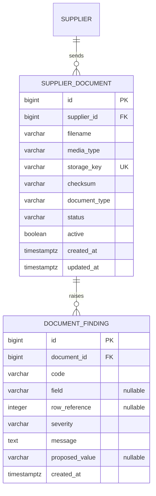

# Supplier document intake

- **Scope:** Store a supplier sheet, parse it, validate it, persist findings
- **Migration:** `d4e8a91c2f07_supplier_documents`
- **Decisions:** [ADR-006](../adr/ADR-006-supplier-document-intake.md)

```bash
make documents file=apps/api/tests/fixtures/supplier_documents/valid.csv supplier=SUP-BEVCO
```

That stores the bytes under `data/documents/`, writes a `supplier_documents`
row, parses the sheet, runs the deterministic rules against the live catalog
and persists findings. Optional semantic review (category suggestion,
summary, recommended action) is a separate call on those findings; see
[AI review](ai-review.md).

```bash
uv run retailops-documents --file path/to/offer.xlsx --supplier SUP-BEVCO
```

CSV and XLSX always use the application parser. Text-based PDFs use the
local PDF adapter when Textract is off. Scanned PDFs and images use
`TextractDocumentAnalyzer` when `AWS_ENABLED` and `AWS_USE_TEXTRACT`
are set. The local adapter will not invent a table from page geometry.

## Lifecycle

```text
received → parsed → validated → review_ready
         ↘ parse_failed
```

`review_ready` means processing finished. Errors and warnings stay on the
document as findings; they do not roll the status back.

## Canonical sheet

| Column | Required | Notes |
|---|---|---|
| `supplier_sku` | yes | Supplier's own item code |
| `ean` | no | 8–14 digits when present |
| `description` | yes | |
| `category` | yes | Catalog code or name |
| `cost` | yes | Unit cost, `Decimal`, ≥ 0 |
| `vat` | yes | Must be a configured rate (default 0, 8, 16) |
| `case_pack` | yes | Integer > 0 |
| `minimum_order_quantity` | yes | Integer ≥ 0 |
| `lead_time_days` | yes | Integer ≥ 0 |

Headers are folded (case, punctuation) through an alias map (`SKU`,
`Barcode`, `IVA`, `MOQ`, …).

## Rules

Intra-document: required fields, EAN shape, cost / VAT / case pack / MOQ /
lead time bounds, duplicate `supplier_sku`, duplicate EAN.

Against the catalog: supplier SKU already mapped to another identity, EAN
already on a product, cost higher than the current term, submitted category
does not match the product that barcode belongs to.

## Storage

`DocumentStorage` is storage-neutral. `LocalDocumentStorage` uses
`<root>/<32-hex-key>` plus a JSON sidecar (filename, media type, checksum).
`S3DocumentStorage` uses the same logical keys against an injected
bucket client. The object key is `{prefix}/{key}/source/payload`.
Set `DOCUMENT_STORAGE_ROOT` or pass `--storage`. Keys that would leave
the root are rejected. Hosted analysis of scanned PDFs is
`TextractDocumentAnalyzer`; local intake still uses the CSV / XLSX /
text-PDF parsers.

## Schema



Findings are removed with their document. A supplier row referenced by a
document cannot be deleted.

## Where the code lives

| Concern | Path |
|---|---|
| Models | `apps/api/src/retailops_api/domain/models/document.py` |
| Storage contract and local root | `apps/api/src/retailops_api/documents/storage.py` |
| S3 storage | `apps/api/src/retailops_api/documents/s3.py` |
| Textract translation | `apps/api/src/retailops_api/documents/textract.py` |
| Canonical columns | `apps/api/src/retailops_api/documents/schema.py` |
| CSV / XLSX | `apps/api/src/retailops_api/documents/parse.py` |
| Text PDF | `apps/api/src/retailops_api/documents/pdf.py` |
| Sheet rules | `apps/api/src/retailops_api/documents/rules.py` |
| Catalog comparison | `apps/api/src/retailops_api/documents/catalog_rules.py` |
| Orchestrator | `apps/api/src/retailops_api/documents/process.py` |
| CLI | `apps/api/src/retailops_api/documents/cli.py` |
| Fixtures | `apps/api/tests/fixtures/supplier_documents/` |
